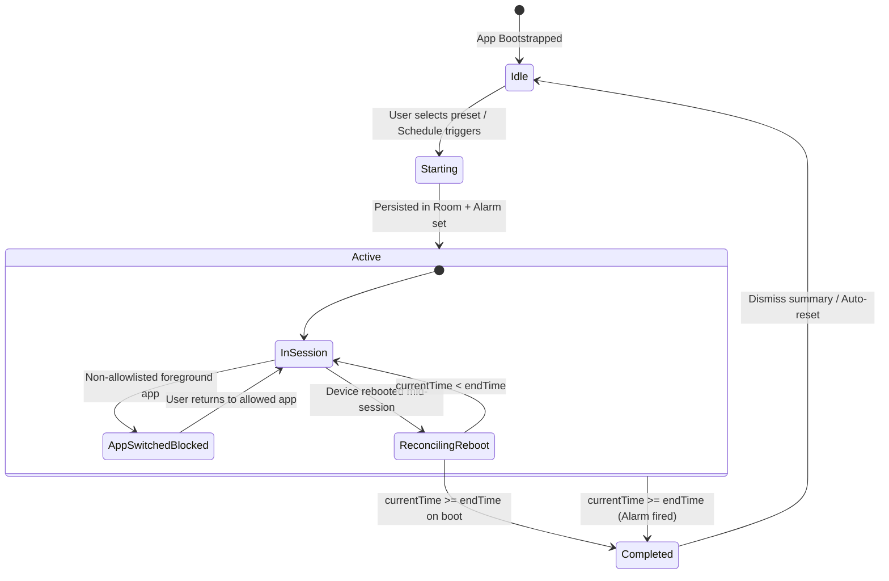
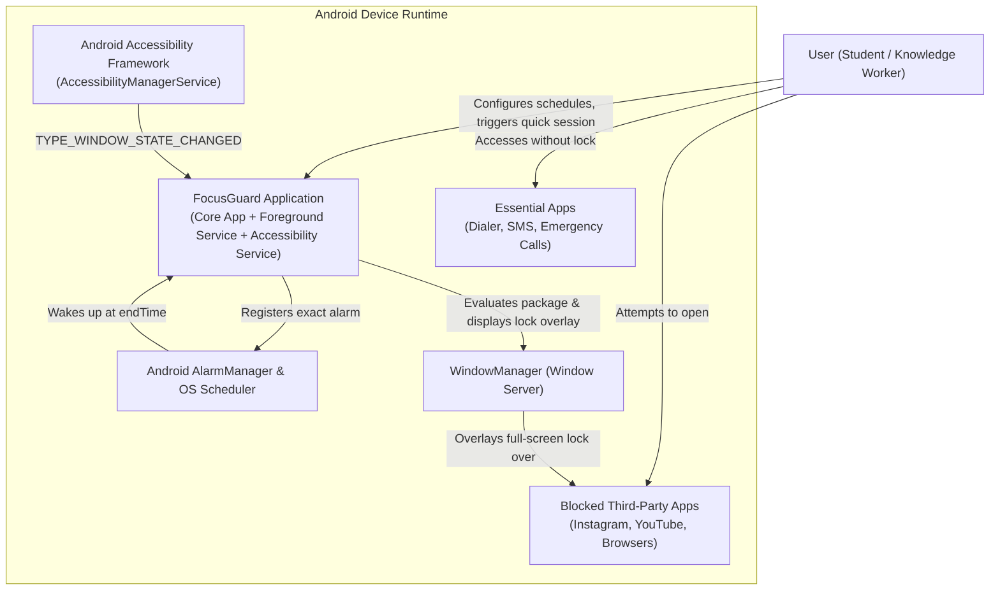
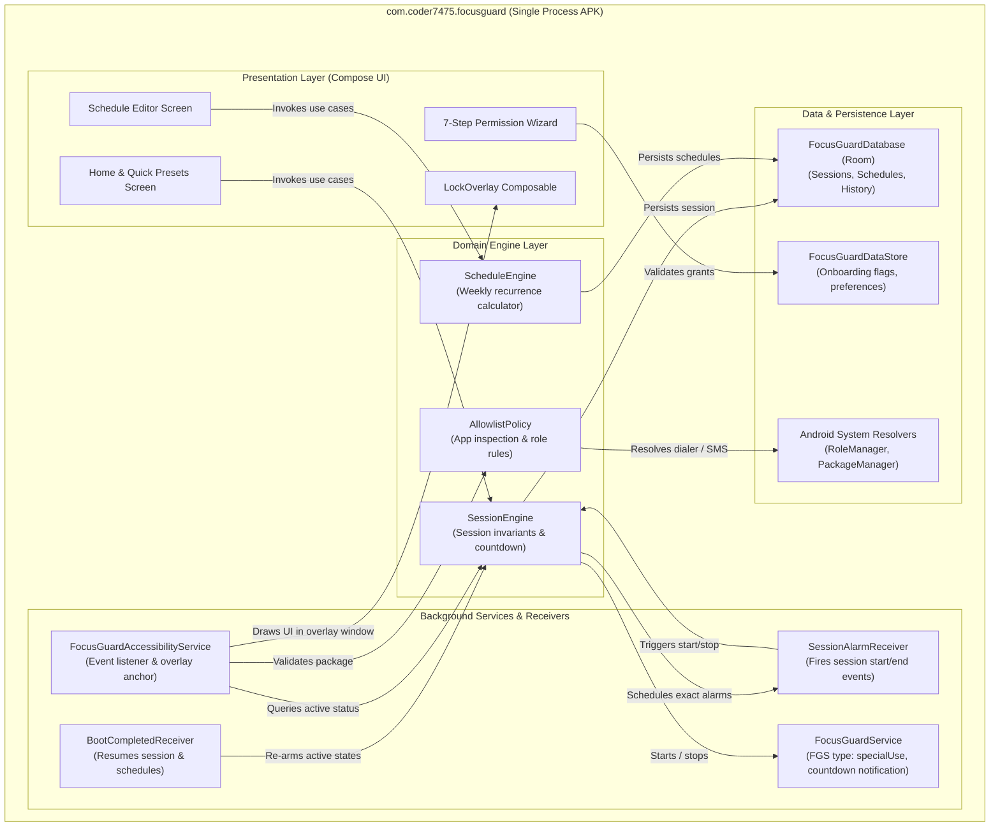
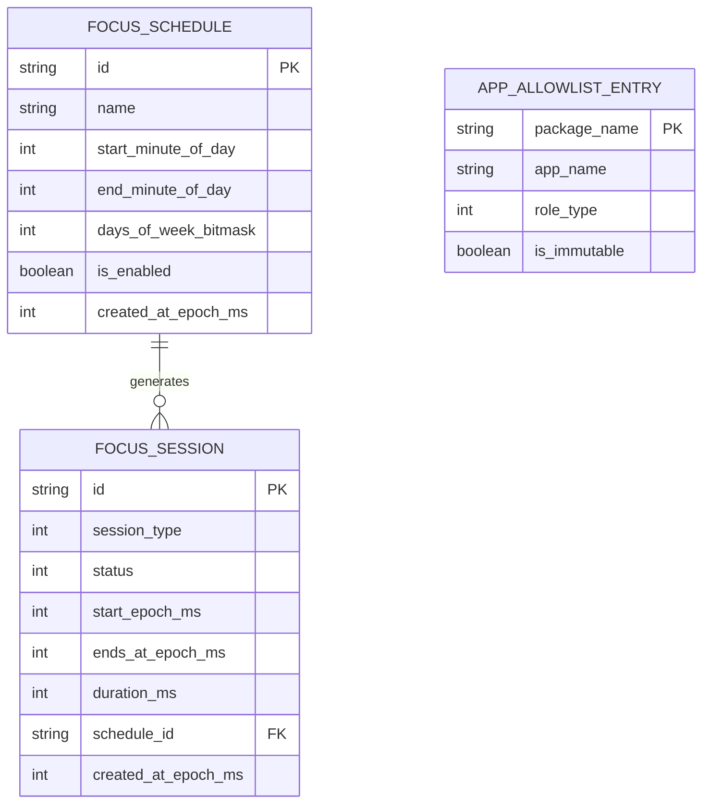

# FocusGuard — MVP System Architecture Document

**Author:** Software Architect & Engineering Team  
**Status:** Approved for Implementation (MVP)  
**Related Specs:** [`doc/mvp/MVP_PLAN.md`](file:///home/fahad/AndroidStudioProjects/focusGuard/doc/mvp/MVP_PLAN.md)  
**Target Platform:** Android (minSdk 24, targetSdk 37) · Kotlin · Jetpack Compose  

---

## 1. Executive Summary & Architectural Vision

FocusGuard is a high-assurance focus and anti-distraction utility for Android. Its foundational business guarantee is:

> **When a focus session is active, the device is unusable for non-essential tasks. Only calls, messaging, and emergency services are accessible. The lock survives app-switching, task-killing, Doze mode, and device reboots.**

Because Android is an open, multi-process operating system with aggressive vendor process killers and dynamic lifecycle states, achieving this guarantee without root or enterprise Device-Owner provisioning requires a resilient architectural design.

This document details the software architecture, bounded contexts, domain invariants, failure modes, and technical decisions governing the MVP release.

---

## 2. Domain Discovery & Modeling

FocusGuard operates around two fundamental sub-domains:
1. **Core Domain (Focus Enforcement & Commitment):** Managing sessions, recurring schedules, and enforcing un-bypassable window locking.
2. **Supporting Sub-Domain (System Lifecycle & Adaptation):** Reconciling device reboots, exact alarms, system permissions, and OEM background management.

```
┌────────────────────────────────────────────────────────────────────────┐
│                        FOCUSGUARD BOUNDED CONTEXTS                     │
├───────────────────────────────┬────────────────────────────────────────┤
│ 1. Focus Session Context      │ 2. Enforcement & Overlay Context       │
│    (Core Aggregates: Session, │    (Allowlist Engine, Window Overlay   │
│     Schedule, Timer)          │     Coordinator, Package Interceptor)  │
├───────────────────────────────┼────────────────────────────────────────┤
│ 3. System Lifecycle Context   │ 4. Platform Adaptation Context         │
│    (Alarm Manager, Boot       │    (Permission Onboarding Wizard,      │
│     Reconciliation, FGS)      │     OEM Battery Guides, Health Check)  │
└───────────────────────────────┴────────────────────────────────────────┘
```

### 2.1 Bounded Contexts & Responsibilities

| Context | Responsibility | Key Entities / Aggregates |
| :--- | :--- | :--- |
| **Focus Session** | Lifecycles of ad-hoc sessions and recurring schedules, countdown calculation, and state progression. | `FocusSession`, `FocusSchedule`, `SessionState`, `SessionPreset` |
| **Enforcement** | Intercepting app switches, evaluating allowlist rules, and rendering the full-screen non-dismissible lock UI. | `AllowlistPolicy`, `ForegroundApp`, `OverlayController`, `LockOverlayView` |
| **System Lifecycle** | Bridging domain events to Android OS primitives (`AlarmManager`, `BOOT_COMPLETED`, foreground service tick). | `AlarmCoordinator`, `BootReconciliation`, `FocusGuardService` |
| **Platform Adaptation** | Validating mandatory permissions, guiding user onboarding, and detecting disabled accessibility services. | `PermissionStep`, `PermissionStatus`, `SystemHealthState` |

### 2.2 Aggregates and Invariants

#### Aggregate: `FocusSession`
- **Root Entity:** `FocusSession`
- **Fields:** `id` (UUID), `startTimeEpochMs`, `endTimeEpochMs`, `durationMs`, `type` (`QUICK` | `SCHEDULED`), `status` (`ACTIVE` | `COMPLETED` | `CANCELLED_BEFORE_START`), `interruptionCount`.
- **Invariants:**
  1. **Strict Non-Cancelability:** Once `status == ACTIVE`, the session *cannot* be transitioned to cancelled or aborted by user action in MVP.
  2. **Single Active Session Rule:** At most one `FocusSession` aggregate can be in `ACTIVE` state across the entire system at any given moment.
  3. **Wall-Clock Monotonicity:** `endTimeEpochMs = startTimeEpochMs + durationMs`. The remaining time is derived dynamically as `max(0, endTimeEpochMs - System.currentTimeMillis())`, never by an in-memory counter variable.

#### Aggregate: `FocusSchedule`
- **Root Entity:** `FocusSchedule`
- **Fields:** `id` (UUID), `name`, `startLocalTime` (e.g. 20:00), `endLocalTime` (e.g. 08:00), `daysOfWeek` (Bitmask / Set of `DayOfWeek`), `isEnabled` (Boolean).
- **Invariants:**
  1. **Overnight Window Support:** If `endLocalTime <= startLocalTime`, the schedule implicitly crosses midnight into the next calendar day.
  2. **Conflict Prevention:** Active schedules must not define conflicting overlapping time intervals on the same day.

#### Aggregate: `AllowlistPolicy`
- **Value Objects:** `PackageIdentifier`, `AllowlistRule`, `AppRole` (`DIALER`, `SMS`, `EMERGENCY`).
- **Invariants:**
  1. **Inviolable System Roles:** Default telephone dialer, SMS messaging provider, and emergency dialer packages are hardcoded as immutable pass-throughs.
  2. **Fail-Safe Permissiveness for Telecom:** If an incoming call or outgoing emergency intent triggers, enforcement must yield immediately.

### 2.3 Domain State Machine: Session Lifecycle



---

## 3. C4 Architecture Specification

### 3.1 C4 Level 1: System Context Diagram

Visualizes how FocusGuard interacts with the user, the Android OS subsystems, and other apps on the device.



### 3.2 C4 Level 2: Container Diagram

Describes the high-level executable modules within the FocusGuard Android package.



### 3.3 C4 Level 3: Component Diagram (Enforcement & Overlay Engine)

FocusGuard’s core technical complexity is concentrated in the interaction between the Android Accessibility subsystem, `WindowManager`, and Compose UI.

```mermaid
flowchart LR
    subgraph A11y_Subsystem["Enforcement Subsystem"]
        A11yServ["FocusGuardAccessibilityService"]
        EventFilter["WindowEventFilter"]
        AllowlistValidator["AllowlistValidator"]
        OverlayManager["LockOverlayWindowManager"]
    end

    subgraph UI_Rendering["Overlay UI Subsystem"]
        OverlayComposeView["AbstractComposeView / ComposeView"]
        OverlayTheme["FocusGuardTheme"]
        LockContent["LockScreenContent(countdownFlow)"]
    end

    subgraph OS_Surface["Android Window Subsystem"]
        WM["WindowManager.addView()"]
        WMParams["LayoutParams(TYPE_ACCESSIBILITY_OVERLAY)"]
    end

    A11yServ -->|onAccessibilityEvent| EventFilter
    EventFilter -->|Package extracted| AllowlistValidator
    AllowlistValidator -->|Package is BLOCKED & Session ACTIVE| OverlayManager
    AllowlistValidator -->|Package is ALLOWED| OverlayManager
    
    OverlayManager -->|show()| OverlayComposeView
    OverlayComposeView --> OverlayTheme
    OverlayTheme --> LockContent
    OverlayManager -->|attach with params| WM
    WMParams -.-> WM
    OverlayManager -->|hide()| WM
```

---

## 4. Subsystem Detailed Designs

### 4.1 Session & Scheduling Engine (Domain Core)

#### Deterministic Time Calculations
The system never counts elapsed time using in-memory delays (`delay(1000)` or thread sleep) because the Android runtime can kill background threads or pause process execution under Doze.

The absolute source of truth is stored in Room:
```kotlin
data class ActiveSessionRecord(
    val id: String,
    val startTimeEpochMs: Long,
    val endsAtEpochMs: Long,
    val sessionType: SessionType,
    val status: SessionStatus
)
```

- **Remaining Time Calculation:**
  $$\text{remainingMs} = \max(0L, \text{endsAtEpochMs} - \text{System.currentTimeMillis()})$$
- **Completion Condition:**
  $$\text{isCompleted} \iff \text{System.currentTimeMillis()} \ge \text{endsAtEpochMs}$$

#### Schedule Window Logic & Midnight Crossing
Schedules may span past midnight (e.g., 20:00 to 08:00).
- If `startLocalTime < endLocalTime`: Same-day window. Active if $T_{\text{now}} \in [\text{start}, \text{end})$.
- If `startLocalTime > endLocalTime`: Overnight window. Active if $T_{\text{now}} \ge \text{start}$ OR $T_{\text{now}} < \text{end}$.
- `ScheduleEngine` calculates the next absolute trigger epoch timestamp using `java.time.ZonedDateTime` and schedules an exact wakeup alarm via `AlarmManager.setExactAndAllowWhileIdle()`.

### 4.2 Accessibility & Window Overlay Engine

#### Overlay Window Properties
To ensure user cannot dismiss the lock by tapping `Back`, `Home`, or touching underneath:
- **Window Type:** `WindowManager.LayoutParams.TYPE_ACCESSIBILITY_OVERLAY` (available directly to accessibility services without requiring `SYSTEM_ALERT_WINDOW`).
- **Flags:**
  - `FLAG_LAYOUT_IN_SCREEN`: Extends overlay across the complete physical screen including navigation and status bar cutouts.
  - `FLAG_LAYOUT_NO_LIMITS`: Allows edge-to-edge drawing without system insets bounding.
  - `FLAG_NOT_TOUCH_MODAL`: Ensures touches do not leak to background apps.
  - `FLAG_SHOW_WHEN_LOCKED` / `FLAG_KEEP_SCREEN_ON`: Ensures lock appears if screen wakes up while session is active.
- **Pixel Format:** `PixelFormat.TRANSLUCENT`.

#### Compose in `AccessibilityService` Window
An `AccessibilityService` is a `Service`, not an `Activity`. To host Jetpack Compose in an overlay:
1. Wrap a `ComposeView(this)` inside a custom `LifecycleOwner` and `SavedStateRegistryOwner` attached to the service context.
2. Initialize `ViewTreeLifecycleOwner`, `ViewTreeViewModelStoreOwner`, and `ViewTreeSavedStateRegistryOwner` on the root view before calling `WindowManager.addView(view, params)`.
3. Provide the Compose content:
   ```kotlin
   composeView.setContent {
       FocusGuardTheme {
           LockOverlayScreen(
               remainingTimeFlow = sessionEngine.remainingTimeFlow
           )
       }
   }
   ```

### 4.3 Allowlist Policy & Role Resolution

The allowlist must never fail to grant access to phone calls or emergency services:
1. **Dynamic System Resolver:**
   - Resolve default Dialer package via `TelecomManager.getDefaultDialerPackage(context)`.
   - Resolve default SMS package via `Telephony.Sms.getDefaultSmsPackage(context)`.
2. **Hardcoded Fallbacks:**
   - Dialers: `com.google.android.dialer`, `com.android.dialer`, `com.samsung.android.dialer`.
   - Telecom & In-Call UI: `com.android.server.telecom`, `com.android.incallui`, `com.google.android.incallui`.
   - Messaging: `com.google.android.apps.messaging`, `com.android.mms`, `com.samsung.android.messaging`.
   - Emergency Dialer: `com.android.phone.EmergencyDialer`, `com.android.phone`.
3. **Incoming Calls Handling:**
   - When an incoming call arrives, Android’s `Telecom` service creates a high-priority system alert/incoming call window. Because the foreground package changes to the telecom/incall package, FocusGuard's `AllowlistPolicy` immediately evaluates to `ALLOWED`, causing the overlay to dismiss instantly.

### 4.4 Foreground Service (FGS) & Android 14/15 Compliance

FocusGuard utilizes `FocusGuardService` for two specific platform purposes:
1. Raising process importance to prevent the OS from killing the countdown timer and accessibility hooks.
2. Showing an ongoing, user-visible notification with the remaining focus time.

- **Manifest Declaration:**
  ```xml
  <service
      android:name=".service.FocusGuardService"
      android:foregroundServiceType="specialUse"
      android:exported="false">
      <property
          android:name="android.app.PROPERTY_SPECIAL_USE_FGS_SUBTYPE"
          android:value="Focus lock countdown ticker and state preservation" />
  </service>
  ```
- **Android 15 Background-Start Exemption:** Starting an FGS from background triggers restrictions. FocusGuard initiates the FGS:
  - From the UI activity when a quick session is tapped.
  - From an exact alarm (`setExactAndAllowWhileIdle`) with full-screen intent capability when an automatic scheduled session begins.

---

## 5. Resilience & Failure Mode Analysis ("What happens when X fails?")

| Failure Scenario | Root Cause | Impact | Architectural Mitigation |
| :--- | :--- | :--- | :--- |
| **User force-stops the app or reboots device** | User tries to escape lock via reboot; or OS reboots after update. | Process killed, in-memory state wiped. | **Reboot Reconciliation Receiver:** `BootCompletedReceiver` listens for `ACTION_BOOT_COMPLETED` and `ACTION_LOCKED_BOOT_COMPLETED`. Queries Room `ActiveSessionRecord`. If $T_{\text{now}} < \text{endsAtEpochMs}$, re-arms alarm, starts FGS, and updates state. If $T_{\text{now}} \ge \text{endsAtEpochMs}$, marks session completed. |
| **OS kills process in background (OEM Aggression)** | OEM (MIUI, OxygenOS, OneUI) kills background apps during screen-off. | FGS ticker stops; service unbinds. | 1. Persistent Room DB stores `endsAtEpochMs`.<br>2. OS `AlarmManager` operates outside the app process lifecycle and will fire independently.<br>3. When user turns on screen and opens any app, `AccessibilityService.onAccessibilityEvent` re-queries the Room DB, discovers active session, and immediately displays overlay. |
| **User disables Accessibility Service mid-session** | User navigates into system settings to turn off FocusGuard accessibility. | App loses ability to detect windows and show overlay. | 1. App registers a `ContentObserver` on `Settings.Secure.ENABLED_ACCESSIBILITY_SERVICES`.<br>2. On disable event, if session is active, post a maximum-priority heads-up warning notification with alert sound.<br>3. Settings app itself is intercepted: any package `com.android.settings` is blocked during active session unless navigating to allowlisted subcomponents. |
| **System clock manually changed backwards/forwards** | User changes date/time in Settings to bypass countdown. | Wall-clock desyncs. | 1. Store `SystemClock.elapsedRealtime()` alongside epoch time in the active session record.<br>2. Listen for `ACTION_TIME_CHANGED` and `ACTION_TIMEZONE_CHANGED`. If clock tampering is detected, calculate remaining time via `elapsedRealtime()`. |
| **Incoming emergency call (911/112)** | User needs emergency dialer during lock. | Safety critical. | Emergency intent actions (`ACTION_EMERGENCY_ASSIST`, `ACTION_DIAL`) and packages (`com.android.phone.EmergencyDialer`) are evaluated by `AllowlistPolicy` with priority 0. Overlay instantly hides. |
| **Overlay memory leak or rapid app switcher churn** | User spams recents button or rapid app switches. | Rapid `addView`/`removeView` crashes `WindowManager`. | `LockOverlayWindowManager` maintains a single synchronized state flag (`isAttached`) and dispatches changes via a debounced, thread-safe queue. View is reused; visibility is toggled via `View.GONE` / `View.VISIBLE` rather than destroying/recreating Compose views. |

---

## 6. Data Architecture & Persistence

### 6.1 Entity-Relationship Schema



### 6.2 Data Access Patterns

- **`SessionDao`:**
  - `getActiveSession(): Flow<FocusSession?>` (reactive stream observed by domain and UI).
  - `insert(session: FocusSession)`
  - `completeSession(id: String, completedAtEpochMs: Long)`
  - `getCompletedSessionsCount(): Flow<Int>`
- **`ScheduleDao`:**
  - `getAllSchedules(): Flow<List<FocusSchedule>>`
  - `getEnabledSchedules(): List<FocusSchedule>`
  - `upsert(schedule: FocusSchedule)`
  - `delete(scheduleId: String)`
- **`DataStore` (`focusguard_prefs`):**
  - `KEY_ONBOARDING_COMPLETED: Boolean`
  - `KEY_LAST_BATTERY_PROMPT_EPOCH_MS: Long`
  - `KEY_STRICT_SETTINGS_BLOCK: Boolean`

---

## 7. Package Structure & Dependency Direction

The architecture enforces a strict **Clean / Layered Architecture** with unidirectional dependency flow:

```
UI / Presentation  ──▶  Domain (Use Cases / Engines)  ◀──  Data / Infrastructure
                                ▲
                                │
                        Android Services
            (Accessibility, FGS, Alarm, Receivers)
```

### Proposed Directory Layout

```
com.coder7475.focusguard/
│
├── core/                                # Cross-cutting utilities & dispatchers
│   ├── common/                          # Result, DispatcherProvider, TimeUtils
│   └── designsystem/                    # Compose Theme, Color, Type, Components
│
├── domain/                              # Pure Kotlin business rules (No Android Framework imports!)
│   ├── model/                           # FocusSession, FocusSchedule, AllowlistRule, SessionStatus
│   ├── repository/                      # SessionRepository, ScheduleRepository, AllowlistRepository
│   ├── engine/                          # SessionEngine, ScheduleEngine, AllowlistPolicy
│   └── usecase/                         # StartQuickSessionUseCase, EvaluateWindowAccessUseCase
│
├── data/                                # Implementations of repositories & persistence
│   ├── local/
│   │   ├── db/                          # FocusGuardDatabase, Room DAOs, Entities, Converters
│   │   └── preferences/                 # UserPreferencesDataStore
│   └── repository/                      # SessionRepositoryImpl, ScheduleRepositoryImpl
│
├── platform/                            # Android platform wrappers & system bridges
│   ├── alarm/                           # AndroidAlarmScheduler, SessionAlarmReceiver
│   ├── boot/                            # BootCompletedReceiver, BootReconciler
│   ├── permission/                      # PermissionChecker, PermissionRegistry
│   └── role/                            # SystemRoleResolver (Telecom, Telephony)
│
├── service/                             # Android Application Services
│   ├── accessibility/                   # FocusGuardAccessibilityService, WindowEventInspector
│   ├── overlay/                         # LockOverlayWindowManager, OverlayLifecycleOwner
│   └── foreground/                      # FocusGuardService, NotificationFactory
│
└── ui/                                  # Jetpack Compose UI
    ├── home/                            # Home screen, Quick presets, Session status card
    ├── schedule/                        # Schedule list, Schedule detail/edit dialog
    ├── onboarding/                      # Permission wizard screens & progress
    ├── overlay/                         # Fullscreen lock overlay Compose layout
    └── MainActivity.kt                  # Single-activity container
```

---

## 8. Quality Attributes & Trade-Off Matrix

| Architectural Choice | Trade-Off Made | Alternatives Rejected | Rationale |
| :--- | :--- | :--- | :--- |
| **Accessibility Service + Overlay** | Requires sensitive Play store declaration and user grant flow. | Device Owner / MDM; UsageStats Polling Loop. | Device Owner is impossible for consumer Play distribution. UsageStats polling adds battery drain and 500ms–2s latency, allowing users to briefly see blocked apps. A11y is zero-latency and event-driven. |
| **Wall-Clock Epoch Storage in Room** | Requires handling device clock tampering. | In-memory coroutine timer or service-only StateFlow. | In-memory timers cannot survive process death, OS low-memory kills, or device reboots. Epoch math in SQLite is crash-proof and reboot-proof. |
| **AlarmManager (`setExactAndAllowWhileIdle`)** | Requires `SCHEDULE_EXACT_ALARM` special access permission on API 33+. | `WorkManager` periodic work; Handler delay loop. | `WorkManager` has a 15-minute minimum interval and runs inexactly. Focus sessions demand to-the-second precision for unlocking. |
| **ComposeView in `TYPE_ACCESSIBILITY_OVERLAY`** | Requires synthetic `LifecycleOwner` and `SavedStateRegistryOwner` plumbing on the service view. | Native Android XML Views / RemoteViews. | Keeping the lock screen in Jetpack Compose preserves a single unified design system, shared animations, and direct binding to Kotlin `Flow` without maintaining dual XML layouts. |
| **Hardcoded Default Dialer & SMS Allowlist** | User cannot customize blocked apps in MVP (locks everything non-essential). | Custom app selector with `QUERY_ALL_PACKAGES`. | Reduces Play review risk, keeps MVP scope razor-focused on anti-addiction, and completely avoids accidental blocking of 911/emergency dialers. |

---

## 9. Verification & Testing Strategy

### 9.1 Unit Tests (JVM)
- **`SessionEngineTest`:** Validates start, active invariant check, duplicate start rejection, countdown epoch calculation.
- **`ScheduleEngineTest`:** Validates midnight-crossing intervals (20:00 to 08:00), day-of-week bitmasks, next alarm trigger time generation.
- **`AllowlistPolicyTest`:** Verifies system dialer and emergency packages always return `ALLOWED`, random social media packages return `BLOCKED`.

### 9.2 Instrumented Tests (Android / Device)
- **`SessionDatabaseTest`:** Tests Room CRUD, migrations, and transactional updates.
- **`LockOverlayWindowManagerTest`:** Verifies window attach/detach without memory leaks or crashes during rapid toggle simulation.
- **`BootReconciliationTest`:** Simulates device boot intent with an active session in Room; verifies alarm rescheduled and FGS restarted.

### 9.3 Manual Smoke Test Matrix (M5 Release Gate)
1. **The 15-minute Lockout:** Start quick session -> attempt opening Chrome, Instagram, Settings -> verify overlay blocks immediately within 50ms.
2. **Emergency / Call Test:** Initiate incoming call -> verify overlay yields immediately to system caller ID -> end call -> verify overlay returns.
3. **Reboot Mid-Session:** Start 45-minute session -> reboot phone at minute 10 -> verify phone powers on with lock active and 35 minutes remaining.
4. **End-of-Session Alarm:** Let timer reach 0:00 -> verify overlay dismisses automatically, notification rings, completed session count increments.
