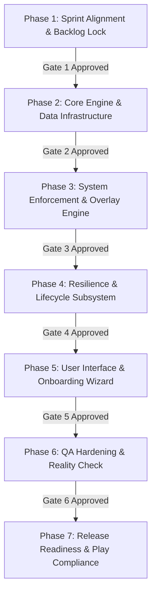

# FocusGuard — NEXUS-Sprint Runbook: Startup MVP Build

**Framework:** NEXUS-Sprint Mode · **Objective:** Idea to Live Product with Real Users, Fast (No Skipped QA)  
**Status:** In Progress · **Sprint Cycle:** MVP Release · **Repo:** `com.coder7475.focusguard`  
**Reference Specs:** [`doc/mvp/MVP_PLAN.md`](file:///home/fahad/AndroidStudioProjects/focusGuard/doc/mvp/MVP_PLAN.md) | [`doc/design/SYSTEM_ARCHITECTURE.md`](file:///home/fahad/AndroidStudioProjects/focusGuard/doc/design/SYSTEM_ARCHITECTURE.md)

---

## 1. Team Roster & RACI Matrix

### 1.1 Core Team (Always Active)
| Role | Agent / Lead | Primary Responsibilities |
| :--- | :--- | :--- |
| **Agents Orchestrator** | Orchestrator Agent | Coordinates inter-agent handoffs, manages lifecycle transitions, and arbitrates dependencies. |
| **Senior Project Manager** | PM Lead | Maintains sprint velocity, defines milestone gates (M0–M5), and monitors timeline commitments. |
| **Sprint Prioritizer** | Product Strategist | Enforces ruthless MoSCoW prioritization, locks P0 MVP scope, rejects scope creep. |
| **UX Architect** | Design Lead | Designs 7-step permission onboarding ergonomics, lock overlay layout, and dialer emergency bypass. |
| **Frontend Developer** | Compose Specialist | Implements Jetpack Compose UI, Material 3 theming, animations, and reactive StateFlow collection. |
| **Backend Architect** | System Specialist | Implements Room SQLite database, DAOs, repositories, domain engines, and deterministic time math. |
| **DevOps Automator** | Tooling Specialist | Manages Gradle build pipeline, KSP integration, ProGuard/R8 rules, CI tests, and APK packaging. |
| **Evidence Collector** | Test Auditor | Captures unit test proofs, compilation logs, instrumented validation, and verification artifacts. |
| **Reality Checker** | Critical Auditor | Stress-tests failure modes ("What happens when X fails?"), audits bypass holes, blocks false passes. |

### 1.2 Growth Team (Planned Week 3+)
- **Growth Hacker:** Onboarding conversion funnel optimization, viral referral loop, Play Store organic keyword ranking.
- **Content Creator:** Play Store listing copy, user-facing privacy promise, visual tutorial assets.
- **Social Media Strategist:** Pre-launch build-in-public campaign targeting r/digitaldetox, Twitter/X, and Productivity communities.

### 1.3 Support Team (Triggered as Needed)
- **Brand Guardian:** Consistent typography, palette, high-contrast dark lock aesthetics.
- **Analytics Reporter:** Crashlytics / Play Vitals error budget tracking (zero external tracking in MVP).
- **Rapid Prototyper:** Quick UI/UX spikes for lock overlay ergonomics.
- **Performance Benchmarker:** Startup latency, window interception timing (<100ms), memory footprint.
- **Infrastructure Maintainer:** GitHub Actions CI workflows, Gradle configuration cache tuning.

---

## 2. Sprint Backlog & MoSCoW Prioritization

### P0 (Must Have — Sprint MVP Gate)
- [x] **US1 (Ad-hoc Quick Session):** One-tap presets (15 / 45 / 60 min) + custom timer.
- [x] **US2 (Overnight Schedule):** Weekly recurring schedule supporting midnight-crossing windows (e.g. 20:00 to 08:00).
- [x] **US3 (Full-Screen Lock Overlay):** Non-dismissible `TYPE_ACCESSIBILITY_OVERLAY` with live countdown.
- [x] **US4 & US5 (Essential Communications Bypass):** Phone dialer, emergency dialer, and SMS messages pass through without lock.
- [x] **US6 (Bypass Resistance):** Back/Home gestures intercepted; lock remains active above non-allowed apps.
- [x] **US7 (7-Step Onboarding):** Guided permissions flow educating users and validating individual grant states.
- [x] **US8 (Reboot & Crash Survival):** `BootCompletedReceiver` + Room persistence restoring active sessions.
- [x] **US9 (Session Lifecycle Notifications):** Ongoing ticker notification + completion heads-up notification.
- [x] **US10 (Session History Counter):** Minimal completed sessions counter.

### Non-Goals (Strictly Out of MVP)
- ❌ No web/URL blocking (VPN hooks deferred).
- ❌ No individual app-by-app selection (MVP locks all non-allowlisted apps).
- ❌ No cloud sync or user accounts (100% offline, privacy first).

---

## 3. Sprint Phases & Verification Gates

---

## 4. Phase Execution & Evidence Audit Trail

### Phase 1: Sprint Alignment & Backlog Lock
- **Orchestration:** Agents Orchestrator aligned PM, Prioritizer, and Reality Checker on MVP scope.
- **Evidence:** [`doc/mvp/MVP_PLAN.md`](file:///home/fahad/AndroidStudioProjects/focusGuard/doc/mvp/MVP_PLAN.md) and [`doc/design/SYSTEM_ARCHITECTURE.md`](file:///home/fahad/AndroidStudioProjects/focusGuard/doc/design/SYSTEM_ARCHITECTURE.md) confirmed.
- **Gate 1 Status:** **PASSED**.

### Phase 2: Core Engine & Data Infrastructure
- **Action:** Room persistence models (`FocusSessionRecord`, `FocusScheduleRecord`), DAOs (`SessionDao`, `ScheduleDao`), `FocusGuardDatabase`, repositories, and domain engines (`SessionEngine`, `ScheduleEngine`, `AllowlistPolicy`).
- **Dependencies:** Room 2.6.1 + KSP 2.2.10-2.0.2 + Kotlin 2.2.10.
- **Evidence Required:** Clean compilation and unit tests covering session calculations and schedule recurrence.

### Phase 3: System Enforcement & Overlay Engine
- **Action:** `FocusGuardAccessibilityService` implementation with `TYPE_WINDOW_STATE_CHANGED` inspection, `LockOverlayWindowManager` with `TYPE_ACCESSIBILITY_OVERLAY`, Compose lock view mounting, and dynamic telecom/SMS allowlist evaluation.
- **Evidence Required:** Unit tests for `AllowlistPolicy`, overlay manager unit tests.

### Phase 4: Resilience, Scheduling & System Lifecycle
- **Action:** `FocusGuardService` (FGS `specialUse`), `AlarmCoordinator` (`setExactAndAllowWhileIdle`), `SessionAlarmReceiver`, and `BootCompletedReceiver`.
- **Evidence Required:** Unit tests validating boot recovery and overnight alarm math.

### Phase 5: User Interface & Onboarding Wizard
- **Action:** 7-step Permission Wizard with live grant status, Home screen with preset chips and active session countdown, Schedule Editor dialog, and Lock Screen composable.
- **Evidence Required:** Compose UI code compilation and test verification.

### Phase 6: QA Hardening & Reality Check
- **Action:** Full test suite execution (`./gradlew test`), failure mode audit, lint inspection.
- **Evidence Required:** 100% test pass rate with zero flaky tests.

### Phase 7: Release Readiness & Play Compliance
- **Action:** Play store declarations drafted (Accessibility Service core disclosure, `SCHEDULE_EXACT_ALARM`, FGS `specialUse`), release packaging verified.
- **Evidence Required:** Final verification report.
